# 数据库设计文档

> **文档状态**：草案（Draft）
> **版本**：v0.0.1
> **编制人**：张牧之
> **编制日期**：2026年
> **关联文档**：《膳食类产品线上推广平台 需求文档》
> **数据库**：PostgreSQL

---

## 1. 设计说明

### 1.1 命名规范

| 规范项 | 说明 |
|--------|------|
| 表名 | 小写蛇形命名（snake_case），复数形式 |
| 字段名 | 小写蛇形命名（snake_case） |
| 主键 | 统一使用 `id`，类型为 `BIGSERIAL` |
| 外键 | 格式为 `{关联表单数}_id` |
| 时间字段 | 统一使用 `TIMESTAMPTZ`（带时区） |
| 布尔字段 | 使用 `BOOLEAN`，默认 `FALSE` |
| 软删除 | 使用 `deleted_at TIMESTAMPTZ` 字段，NULL表示未删除 |
| 金额字段 | 使用 `NUMERIC(10,2)`，积分字段使用 `INTEGER` |

### 1.2 通用字段

每张业务表包含以下通用字段：

| 字段 | 类型 | 说明 |
|------|------|------|
| id | BIGSERIAL | 主键，自增 |
| created_at | TIMESTAMPTZ | 创建时间，默认当前时间 |
| updated_at | TIMESTAMPTZ | 更新时间，默认当前时间，自动更新 |
| deleted_at | TIMESTAMPTZ | 软删除时间，NULL表示未删除 |

## 2. 数据库关系图

```mermaid
erDiagram

%% ===================== 用户与基础 =====================
users ||--o| promotion_relations : "user_id"
users ||--o| addresses : "user_id"
users ||--o| carts : "user_id"
users ||--o| favorites : "user_id"
users ||--o| points_accounts : "user_id"
users ||--o| withdraw_requests : "user_id"
users ||--o| order_reviews : "user_id"

%% ===================== 推广关系 =====================
users ||--o| promotion_relations : "direct_parent_id"
users ||--o| promotion_relations : "parent_node_id"

%% ===================== 订单 =====================
users ||--o{ orders : "user_id"
orders ||--|{ order_items : "order_id"
products ||--o{ order_items : "product_id"
categories ||--o{ products : "category_id"

orders ||--o| payment_records : "order_id"
orders ||--o| refund_records : "order_id"
orders ||--o| order_reviews : "order_id"

%% ===================== 积分与返积分 =====================
orders ||--o{ reward_records : "order_id"
users ||--o{ reward_records : "beneficiary_user_id"
users ||--o{ reward_records : "source_user_id"

points_accounts ||--o{ points_transactions : "user_id"
orders ||--o| points_transactions : "order_id"

%% ===================== 提现 =====================
withdraw_requests }o--|| users : "reviewed_by"

%% ===================== 分享 =====================
users ||--o{ share_records : "sharer_id"
users ||--o| share_records : "bound_user_id"

%% ===================== 管理员与系统 =====================
admin_users ||--o{ operation_logs : "admin_user_id"
admin_users ||--o{ system_configs : "updated_by"
admin_users ||--o{ announcements : "published_by"
```

### 2.1 关系说明

| 关系 | 说明 |
|------|------|
| `users 1 ─ n orders` | 一个用户可有多笔订单 |
| `orders 1 ─ n order_items` | 一笔订单包含多个商品明细 |
| `products 1 ─ n order_items` | 一个产品可出现在多个订单明细中 |
| `categories 1 ─ n products` | 一个分类下可有多个产品 |
| `orders 1 ─ 0/1 payment_records` | 一笔订单对应一条支付记录 |
| `orders 1 ─ 0/1 refund_records` | 一笔订单可产生一条退款记录 |
| `users 1 ─ 1 promotion_relations` | 一个用户对应一条推广关系 |
| `users 1 ─ n reward_records` | 用户可有多条返积分记录 |
| `users 1 ─ 1 points_accounts` | 一个用户对应一个积分账户 |
| `points_accounts 1 ─ n points_transactions` | 积分账户有多条流水 |
| `users 1 ─ n withdraw_requests` | 用户可有多条提现申请 |
| `users 1 ─ n addresses` | 用户可有多个收货地址 |
| `users 1 ─ n carts` | 用户购物车可有多条记录 |
| `users 1 ─ n favorites` | 用户可收藏多个产品 |
| `users 1 ─ n share_records` | 推广者可有多条分享记录 |
| `users 1 ─ n order_reviews` | 用户可有多条评价 |
| `admin_users 1 ─ n operation_logs` | 管理员可产生多条操作日志 |
| `admin_users 1 ─ n system_configs` | 管理员可更新多条系统配置 |
| `admin_users 1 ─ n announcements` | 管理员可发布多条公告 |

## 3. 核心业务表

### 3.1 users — 用户表

| 字段 | 类型 | 可空 | 默认值 | 说明 |
|------|------|------|--------|------|
| id | BIGSERIAL | 否 | 自增 | 主键 |
| openid | VARCHAR(64) | 否 | — | 微信OpenID，唯一 |
| unionid | VARCHAR(64) | 是 | NULL | 微信UnionID |
| nickname | VARCHAR(64) | 是 | NULL | 用户昵称 |
| avatar_url | VARCHAR(512) | 是 | NULL | 头像URL |
| phone | VARCHAR(20) | 是 | NULL | 手机号（脱敏存储） |
| role | VARCHAR(20) | 否 | 'normal' | 角色：normal-普通用户, promoter-推广者, top_node-顶层节点 |
| status | VARCHAR(20) | 否 | 'active' | 状态：active-正常, banned-封禁 |
| is_promoter | BOOLEAN | 否 | FALSE | 是否推广者（快速查询标识） |
| promoter_type | VARCHAR(20) | 是 | NULL | 推广者类型：upgraded-升级获得, top_node-顶层节点 |
| upgraded_at | TIMESTAMPTZ | 是 | NULL | 升级为推广者时间 |
| total_purchased_items | INTEGER | 否 | 0 | 累计有效购买件数 |
| created_at | TIMESTAMPTZ | 否 | now() | 创建时间 |
| updated_at | TIMESTAMPTZ | 否 | now() | 更新时间 |
| deleted_at | TIMESTAMPTZ | 是 | NULL | 软删除时间 |

**索引**：
- 唯一索引：openid
- 普通索引：phone, role, status

### 3.2 products — 产品表

| 字段 | 类型 | 可空 | 默认值 | 说明 |
|------|------|------|--------|------|
| id | BIGSERIAL | 否 | 自增 | 主键 |
| name | VARCHAR(128) | 否 | — | 产品名称 |
| category_id | BIGINT | 否 | — | 分类ID，外键→categories.id |
| price | NUMERIC(10,2) | 否 | — | 销售单价 |
| original_price | NUMERIC(10,2) | 是 | NULL | 原价（划线价） |
| stock | INTEGER | 否 | 0 | 库存数量 |
| sales_count | INTEGER | 否 | 0 | 累计销量 |
| main_image | VARCHAR(512) | 否 | — | 主图URL |
| images | JSONB | 是 | '[]' | 图片列表 |
| description | TEXT | 是 | NULL | 图文详情 |
| status | VARCHAR(20) | 否 | 'on_sale' | 状态：on_sale-在售, off_sale-下架 |
| sort | INTEGER | 否 | 0 | 排序值，越大越靠前 |
| created_at | TIMESTAMPTZ | 否 | now() | 创建时间 |
| updated_at | TIMESTAMPTZ | 否 | now() | 更新时间 |
| deleted_at | TIMESTAMPTZ | 是 | NULL | 软删除时间 |

**索引**：
- 普通索引：category_id, status, sort

### 3.3 categories — 产品分类表

| 字段 | 类型 | 可空 | 默认值 | 说明 |
|------|------|------|--------|------|
| id | BIGSERIAL | 否 | 自增 | 主键 |
| name | VARCHAR(64) | 否 | — | 分类名称 |
| parent_id | BIGINT | 是 | NULL | 父分类ID，NULL为顶级 |
| sort | INTEGER | 否 | 0 | 排序值 |
| status | VARCHAR(20) | 否 | 'active' | 状态：active-启用, disabled-禁用 |
| created_at | TIMESTAMPTZ | 否 | now() | 创建时间 |
| updated_at | TIMESTAMPTZ | 否 | now() | 更新时间 |
| deleted_at | TIMESTAMPTZ | 是 | NULL | 软删除时间 |

### 3.4 orders — 订单表

| 字段 | 类型 | 可空 | 默认值 | 说明 |
|------|------|------|--------|------|
| id | BIGSERIAL | 否 | 自增 | 主键 |
| order_no | VARCHAR(32) | 否 | — | 订单号，唯一 |
| user_id | BIGINT | 否 | — | 下单用户ID，外键→users.id |
| total_amount | NUMERIC(10,2) | 否 | — | 订单总金额 |
| pay_amount | NUMERIC(10,2) | 否 | — | 实付金额 |
| total_items | INTEGER | 否 | 0 | 订单总件数 |
| status | VARCHAR(20) | 否 | 'pending_payment' | 状态：pending_payment-待付款, pending_shipment-待发货, pending_receipt-待收货, completed-已完成, refunding-退款中, refunded-已退款, cancelled-已取消 |
| receiver_name | VARCHAR(64) | 否 | — | 收货人姓名 |
| receiver_phone | VARCHAR(20) | 否 | — | 收货人电话 |
| receiver_address | VARCHAR(512) | 否 | — | 收货地址 |
| tracking_no | VARCHAR(64) | 是 | NULL | 物流单号 |
| shipping_company | VARCHAR(64) | 是 | NULL | 物流公司 |
| paid_at | TIMESTAMPTZ | 是 | NULL | 支付时间 |
| shipped_at | TIMESTAMPTZ | 是 | NULL | 发货时间 |
| completed_at | TIMESTAMPTZ | 是 | NULL | 确认收货时间 |
| cancelled_at | TIMESTAMPTZ | 是 | NULL | 取消时间 |
| refund_deadline | TIMESTAMPTZ | 是 | NULL | 退款保护期截止时间（确认收货+7天） |
| remark | VARCHAR(512) | 是 | NULL | 订单备注 |
| created_at | TIMESTAMPTZ | 否 | now() | 创建时间 |
| updated_at | TIMESTAMPTZ | 否 | now() | 更新时间 |
| deleted_at | TIMESTAMPTZ | 是 | NULL | 软删除时间 |

**索引**：
- 唯一索引：order_no
- 普通索引：user_id, status, created_at, refund_deadline

### 3.5 order_items — 订单明细表

| 字段 | 类型 | 可空 | 默认值 | 说明 |
|------|------|------|--------|------|
| id | BIGSERIAL | 否 | 自增 | 主键 |
| order_id | BIGINT | 否 | — | 订单ID，外键→orders.id |
| product_id | BIGINT | 否 | — | 产品ID，外键→products.id |
| product_name | VARCHAR(128) | 否 | — | 产品名称（下单时快照） |
| product_image | VARCHAR(512) | 是 | NULL | 产品图片（快照） |
| unit_price | NUMERIC(10,2) | 否 | — | 成交单价 |
| quantity | INTEGER | 否 | 1 | 购买数量 |
| subtotal | NUMERIC(10,2) | 否 | — | 小计金额 |
| refund_quantity | INTEGER | 否 | 0 | 已退款数量 |
| created_at | TIMESTAMPTZ | 否 | now() | 创建时间 |
| updated_at | TIMESTAMPTZ | 否 | now() | 更新时间 |

**索引**：
- 普通索引：order_id, product_id

### 3.6 promotion_relations — 推广关系表

| 字段 | 类型 | 可空 | 默认值 | 说明 |
|------|------|------|--------|------|
| id | BIGSERIAL | 否 | 自增 | 主键 |
| user_id | BIGINT | 否 | — | 用户ID，外键→users.id，唯一 |
| direct_parent_id | BIGINT | 是 | NULL | 直接发展人ID，外键→users.id |
| parent_node_id | BIGINT | 是 | NULL | 上一层挂靠节点ID，外键→users.id |
| position | SMALLINT | 是 | NULL | 在发展人名下的序号：1/2/3 |
| is_top_node | BOOLEAN | 否 | FALSE | 是否顶层节点 |
| source | VARCHAR(20) | 是 | NULL | 绑定来源：share-转发分享, qrcode-推广码, manual-手动 |
| bound_at | TIMESTAMPTZ | 否 | now() | 绑定时间 |
| created_at | TIMESTAMPTZ | 否 | now() | 创建时间 |
| updated_at | TIMESTAMPTZ | 否 | now() | 更新时间 |

**索引**：
- 唯一索引：user_id
- 普通索引：direct_parent_id, parent_node_id, is_top_node

### 3.7 points_accounts — 积分账户表

| 字段 | 类型 | 可空 | 默认值 | 说明 |
|------|------|------|--------|------|
| id | BIGSERIAL | 否 | 自增 | 主键 |
| user_id | BIGINT | 否 | — | 用户ID，外键→users.id，唯一 |
| total_points | INTEGER | 否 | 0 | 总积分（可结算+冻结） |
| available_points | INTEGER | 否 | 0 | 可结算积分 |
| frozen_points | INTEGER | 否 | 0 | 冻结积分 |
| total_earned | INTEGER | 否 | 0 | 累计获得积分 |
| total_spent | INTEGER | 否 | 0 | 累计消耗积分（提现+扣减） |
| created_at | TIMESTAMPTZ | 否 | now() | 创建时间 |
| updated_at | TIMESTAMPTZ | 否 | now() | 更新时间 |

**索引**：
- 唯一索引：user_id

### 3.8 points_transactions — 积分流水表

| 字段 | 类型 | 可空 | 默认值 | 说明 |
|------|------|------|--------|------|
| id | BIGSERIAL | 否 | 自增 | 主键 |
| user_id | BIGINT | 否 | — | 用户ID，外键→users.id |
| order_id | BIGINT | 是 | NULL | 关联订单ID，外键→orders.id |
| reward_record_id | BIGINT | 是 | NULL | 关联返积分记录ID，外键→reward_records.id |
| transaction_type | VARCHAR(30) | 否 | — | 类型：direct_reward-直返, indirect_reward-间返, unfreeze-解冻, freeze-冻结, withdraw-提现扣减, refund_deduct-退款扣减, manual_adjust-手动调整, expire-过期 |
| amount | INTEGER | 否 | — | 变动金额（正数为增加，负数为扣减） |
| balance_after | INTEGER | 否 | — | 变动后总积分 |
| available_after | INTEGER | 否 | — | 变动后可结算积分 |
| frozen_after | INTEGER | 否 | — | 变动后冻结积分 |
| description | VARCHAR(512) | 是 | NULL | 描述说明 |
| operator_id | BIGINT | 是 | NULL | 操作人ID（手动操作时） |
| created_at | TIMESTAMPTZ | 否 | now() | 创建时间 |

**索引**：
- 普通索引：user_id, order_id, transaction_type, created_at

### 3.9 reward_records — 返积分记录表

| 字段 | 类型 | 可空 | 默认值 | 说明 |
|------|------|------|--------|------|
| id | BIGSERIAL | 否 | 自增 | 主键 |
| order_id | BIGINT | 否 | — | 订单ID，外键→orders.id |
| order_item_index | INTEGER | 否 | 0 | 订单内第几件（间返用，直返为0表示整单） |
| beneficiary_user_id | BIGINT | 否 | — | 获得积分用户ID，外键→users.id |
| source_user_id | BIGINT | 否 | — | 下单用户ID，外键→users.id |
| reward_type | VARCHAR(20) | 否 | — | 类型：direct-直返, indirect-间返 |
| amount | INTEGER | 否 | — | 返积分金额 |
| level | INTEGER | 否 | 0 | 层级（0=直属直返，1=上一层间返，依次递增） |
| status | VARCHAR(20) | 否 | 'frozen' | 状态：frozen-冻结, available-可结算, deducted-已扣减, cancelled-已取消 |
| unfreeze_at | TIMESTAMPTZ | 是 | NULL | 预计解冻时间 |
| unfrozen_at | TIMESTAMPTZ | 是 | NULL | 实际解冻时间 |
| deducted_amount | INTEGER | 否 | 0 | 已扣减金额 |
| created_at | TIMESTAMPTZ | 否 | now() | 创建时间 |
| updated_at | TIMESTAMPTZ | 否 | now() | 更新时间 |

**索引**：
- 普通索引：order_id, beneficiary_user_id, status, reward_type

### 3.10 withdraw_requests — 提现申请表

| 字段 | 类型 | 可空 | 默认值 | 说明 |
|------|------|------|--------|------|
| id | BIGSERIAL | 否 | 自增 | 主键 |
| user_id | BIGINT | 否 | — | 用户ID，外键→users.id |
| amount | INTEGER | 否 | — | 提现积分金额 |
| pay_method | VARCHAR(20) | 否 | — | 打款方式：bank_card-银行卡, alipay-支付宝, wechat-微信转账 |
| account_info | JSONB | 否 | — | 收款账户信息 |
| status | VARCHAR(20) | 否 | 'pending' | 状态：pending-待审核, approved-已通过, rejected-已驳回, paid-已打款, cancelled-已取消 |
| reviewed_by | BIGINT | 是 | NULL | 审核人ID，外键→users.id（管理员） |
| reviewed_at | TIMESTAMPTZ | 是 | NULL | 审核时间 |
| reject_reason | VARCHAR(512) | 是 | NULL | 驳回原因 |
| paid_at | TIMESTAMPTZ | 是 | NULL | 打款时间 |
| created_at | TIMESTAMPTZ | 否 | now() | 创建时间 |
| updated_at | TIMESTAMPTZ | 否 | now() | 更新时间 |

**索引**：
- 普通索引：user_id, status, created_at

## 4. 非核心业务表

### 4.1 payment_records — 支付记录表

| 字段 | 类型 | 可空 | 默认值 | 说明 |
|------|------|------|--------|------|
| id | BIGSERIAL | 否 | 自增 | 主键 |
| order_id | BIGINT | 否 | — | 订单ID，外键→orders.id |
| transaction_id | VARCHAR(64) | 是 | NULL | 微信支付交易号 |
| amount | NUMERIC(10,2) | 否 | — | 支付金额 |
| status | VARCHAR(20) | 否 | 'pending' | 状态：pending-待支付, success-成功, failed-失败, refunded-已退款 |
| pay_method | VARCHAR(20) | 否 | 'wechat' | 支付方式 |
| paid_at | TIMESTAMPTZ | 是 | NULL | 支付时间 |
| created_at | TIMESTAMPTZ | 否 | now() | 创建时间 |
| updated_at | TIMESTAMPTZ | 否 | now() | 更新时间 |

**索引**：
- 普通索引：order_id, transaction_id, status

### 4.2 refund_records — 退款记录表

| 字段 | 类型 | 可空 | 默认值 | 说明 |
|------|------|------|--------|------|
| id | BIGSERIAL | 否 | 自增 | 主键 |
| order_id | BIGINT | 否 | — | 订单ID，外键→orders.id |
| refund_no | VARCHAR(32) | 否 | — | 退款单号，唯一 |
| refund_amount | NUMERIC(10,2) | 否 | — | 退款金额 |
| refund_items | INTEGER | 否 | 0 | 退款件数 |
| reason | VARCHAR(512) | 是 | NULL | 退款原因 |
| status | VARCHAR(20) | 否 | 'pending' | 状态：pending-待审核, approved-已通过, rejected-已驳回, completed-已完成 |
| points_deducted | INTEGER | 否 | 0 | 扣减的积分数 |
| reviewed_by | BIGINT | 是 | NULL | 审核人ID |
| reviewed_at | TIMESTAMPTZ | 是 | NULL | 审核时间 |
| completed_at | TIMESTAMPTZ | 是 | NULL | 完成时间 |
| created_at | TIMESTAMPTZ | 否 | now() | 创建时间 |
| updated_at | TIMESTAMPTZ | 否 | now() | 更新时间 |

**索引**：
- 唯一索引：refund_no
- 普通索引：order_id, status

### 4.3 carts — 购物车表

| 字段 | 类型 | 可空 | 默认值 | 说明 |
|------|------|------|--------|------|
| id | BIGSERIAL | 否 | 自增 | 主键 |
| user_id | BIGINT | 否 | — | 用户ID，外键→users.id |
| product_id | BIGINT | 否 | — | 产品ID，外键→products.id |
| quantity | INTEGER | 否 | 1 | 数量 |
| created_at | TIMESTAMPTZ | 否 | now() | 创建时间 |
| updated_at | TIMESTAMPTZ | 否 | now() | 更新时间 |

**索引**：
- 唯一索引：(user_id, product_id)

### 4.4 addresses — 收货地址表

| 字段 | 类型 | 可空 | 默认值 | 说明 |
|------|------|------|--------|------|
| id | BIGSERIAL | 否 | 自增 | 主键 |
| user_id | BIGINT | 否 | — | 用户ID，外键→users.id |
| receiver_name | VARCHAR(64) | 否 | — | 收货人姓名 |
| receiver_phone | VARCHAR(20) | 否 | — | 收货人电话 |
| province | VARCHAR(64) | 否 | — | 省 |
| city | VARCHAR(64) | 否 | — | 市 |
| district | VARCHAR(64) | 否 | — | 区/县 |
| detail | VARCHAR(512) | 否 | — | 详细地址 |
| is_default | BOOLEAN | 否 | FALSE | 是否默认地址 |
| created_at | TIMESTAMPTZ | 否 | now() | 创建时间 |
| updated_at | TIMESTAMPTZ | 否 | now() | 更新时间 |
| deleted_at | TIMESTAMPTZ | 是 | NULL | 软删除时间 |

**索引**：
- 普通索引：user_id

### 4.5 favorites — 收藏表

| 字段 | 类型 | 可空 | 默认值 | 说明 |
|------|------|------|--------|------|
| id | BIGSERIAL | 否 | 自增 | 主键 |
| user_id | BIGINT | 否 | — | 用户ID，外键→users.id |
| product_id | BIGINT | 否 | — | 产品ID，外键→products.id |
| created_at | TIMESTAMPTZ | 否 | now() | 创建时间 |

**索引**：
- 唯一索引：(user_id, product_id)

### 4.6 share_records — 分享转发记录表

| 字段 | 类型 | 可空 | 默认值 | 说明 |
|------|------|------|--------|------|
| id | BIGSERIAL | 否 | 自增 | 主键 |
| sharer_id | BIGINT | 否 | — | 分享者用户ID，外键→users.id |
| share_type | VARCHAR(20) | 否 | — | 分享类型：mini_program-小程序, product-产品页, promotion-推广中心, poster-海报 |
| share_target | VARCHAR(20) | 是 | NULL | 分享目标：friend-好友, group-群, moments-朋友圈 |
| share_token | VARCHAR(64) | 否 | — | 分享唯一标识 |
| bound_user_id | BIGINT | 是 | NULL | 绑定成功的用户ID，外键→users.id |
| bound_at | TIMESTAMPTZ | 是 | NULL | 绑定时间 |
| created_at | TIMESTAMPTZ | 否 | now() | 创建时间 |

**索引**：
- 普通索引：sharer_id, share_token, bound_user_id

### 4.7 admin_users — 管理员表

| 字段 | 类型 | 可空 | 默认值 | 说明 |
|------|------|------|--------|------|
| id | BIGSERIAL | 否 | 自增 | 主键 |
| username | VARCHAR(64) | 否 | — | 用户名，唯一 |
| password_hash | VARCHAR(256) | 否 | — | 密码哈希 |
| name | VARCHAR(64) | 是 | NULL | 显示名称 |
| role | VARCHAR(20) | 否 | 'admin' | 角色：admin-管理员, operator-运营 |
| status | VARCHAR(20) | 否 | 'active' | 状态：active-正常, disabled-禁用 |
| last_login_at | TIMESTAMPTZ | 是 | NULL | 最后登录时间 |
| created_at | TIMESTAMPTZ | 否 | now() | 创建时间 |
| updated_at | TIMESTAMPTZ | 否 | now() | 更新时间 |

**索引**：
- 唯一索引：username

### 4.8 system_configs — 系统配置表

| 字段 | 类型 | 可空 | 默认值 | 说明 |
|------|------|------|--------|------|
| id | BIGSERIAL | 否 | 自增 | 主键 |
| config_key | VARCHAR(64) | 否 | — | 配置键，唯一 |
| config_value | TEXT | 是 | NULL | 配置值（JSON字符串） |
| description | VARCHAR(512) | 是 | NULL | 配置说明 |
| updated_by | BIGINT | 是 | NULL | 最后更新人ID，外键→admin_users.id |
| created_at | TIMESTAMPTZ | 否 | now() | 创建时间 |
| updated_at | TIMESTAMPTZ | 否 | now() | 更新时间 |

**索引**：
- 唯一索引：config_key

**预置配置项**：

| config_key | 默认值 | 说明 |
|------------|--------|------|
| upgrade_item_threshold | 6 | 推广者升级所需购买件数 |
| refund_protection_days | 7 | 退款保护期天数 |
| direct_reward_position_1 | 20 | 第1位直属下级直返比例（%） |
| direct_reward_position_2 | 20 | 第2位直属下级直返比例（%） |
| direct_reward_position_3 | 60 | 第3位直属下级直返比例（%） |
| indirect_reward_amount | 30 | 间返固定积分/件 |
| min_withdraw_points | 100 | 最低提现积分 |
| max_withdraw_per_month | 2 | 每月最大提现次数 |
| points_expire_days | 365 | 积分有效期（天） |

### 4.9 operation_logs — 操作日志表

| 字段 | 类型 | 可空 | 默认值 | 说明 |
|------|------|------|--------|------|
| id | BIGSERIAL | 否 | 自增 | 主键 |
| admin_user_id | BIGINT | 否 | — | 操作人ID，外键→admin_users.id |
| action | VARCHAR(64) | 否 | — | 操作类型 |
| target_type | VARCHAR(64) | 是 | NULL | 操作对象类型 |
| target_id | BIGINT | 是 | NULL | 操作对象ID |
| detail | JSONB | 是 | NULL | 操作详情 |
| ip_address | VARCHAR(64) | 是 | NULL | 操作IP |
| created_at | TIMESTAMPTZ | 否 | now() | 创建时间 |

**索引**：
- 普通索引：admin_user_id, action, created_at

### 4.10 announcements — 公告表

| 字段 | 类型 | 可空 | 默认值 | 说明 |
|------|------|------|--------|------|
| id | BIGSERIAL | 否 | 自增 | 主键 |
| title | VARCHAR(128) | 否 | — | 公告标题 |
| content | TEXT | 否 | — | 公告内容 |
| status | VARCHAR(20) | 否 | 'draft' | 状态：draft-草稿, published-已发布, offline-已下线 |
| published_by | BIGINT | 是 | NULL | 发布人ID，外键→admin_users.id |
| published_at | TIMESTAMPTZ | 是 | NULL | 发布时间 |
| created_at | TIMESTAMPTZ | 否 | now() | 创建时间 |
| updated_at | TIMESTAMPTZ | 否 | now() | 更新时间 |

**索引**：
- 普通索引：status, published_at

### 4.11 order_reviews — 订单评价表

| 字段 | 类型 | 可空 | 默认值 | 说明 |
|------|------|------|--------|------|
| id | BIGSERIAL | 否 | 自增 | 主键 |
| order_id | BIGINT | 否 | — | 订单ID，外键→orders.id |
| user_id | BIGINT | 否 | — | 评价用户ID，外键→users.id |
| product_id | BIGINT | 否 | — | 产品ID，外键→products.id |
| rating | SMALLINT | 否 | 5 | 评分1-5 |
| content | TEXT | 是 | NULL | 评价内容 |
| images | JSONB | 是 | '[]' | 评价图片 |
| created_at | TIMESTAMPTZ | 否 | now() | 创建时间 |

**索引**：
- 普通索引：order_id, product_id

## 5. 表关系总览

| 序号 | 源表 | 目标表 | 关系类型 | 外键字段 | 说明 |
|------|------|--------|----------|----------|------|
| 1 | users | orders | 1:N | orders.user_id | 用户下单 |
| 2 | orders | order_items | 1:N | order_items.order_id | 订单明细 |
| 3 | products | order_items | 1:N | order_items.product_id | 产品出现在多个订单 |
| 4 | categories | products | 1:N | products.category_id | 分类包含产品 |
| 5 | orders | payment_records | 1:1 | payment_records.order_id | 订单支付记录 |
| 6 | orders | refund_records | 1:1 | refund_records.order_id | 订单退款记录 |
| 7 | users | promotion_relations | 1:1 | promotion_relations.user_id | 用户推广关系 |
| 8 | users | promotion_relations | 1:N | promotion_relations.direct_parent_id | 作为直接发展人 |
| 9 | users | promotion_relations | 1:N | promotion_relations.parent_node_id | 作为挂靠上级 |
| 10 | users | points_accounts | 1:1 | points_accounts.user_id | 用户积分账户 |
| 11 | users | points_transactions | 1:N | points_transactions.user_id | 用户积分流水 |
| 12 | orders | points_transactions | 1:N | points_transactions.order_id | 订单关联积分流水 |
| 13 | reward_records | points_transactions | 1:N | points_transactions.reward_record_id | 返积分关联流水 |
| 14 | orders | reward_records | 1:N | reward_records.order_id | 订单返积分记录 |
| 15 | users | reward_records | 1:N | reward_records.beneficiary_user_id | 获得返积分 |
| 16 | users | reward_records | 1:N | reward_records.source_user_id | 来源下单用户 |
| 17 | users | withdraw_requests | 1:N | withdraw_requests.user_id | 用户提现申请 |
| 18 | users | withdraw_requests | 1:N | withdraw_requests.reviewed_by | 审核人 |
| 19 | users | addresses | 1:N | addresses.user_id | 用户地址 |
| 20 | users | carts | 1:N | carts.user_id | 购物车 |
| 21 | users | favorites | 1:N | favorites.user_id | 用户收藏 |
| 22 | users | share_records | 1:N | share_records.sharer_id | 分享者 |
| 23 | users | share_records | 1:N | share_records.bound_user_id | 绑定用户 |
| 24 | users | order_reviews | 1:N | order_reviews.user_id | 用户评价 |
| 25 | admin_users | operation_logs | 1:N | operation_logs.admin_user_id | 管理员操作日志 |
| 26 | admin_users | system_configs | 1:N | system_configs.updated_by | 管理员更新配置 |
| 27 | admin_users | announcements | 1:N | announcements.published_by | 管理员发布公告 |

> **本文档为数据库设计草案，由张牧之编制，供开发参考使用。**
>
> 版本：v0.0.1（Draft）
> 编制日期：2026年